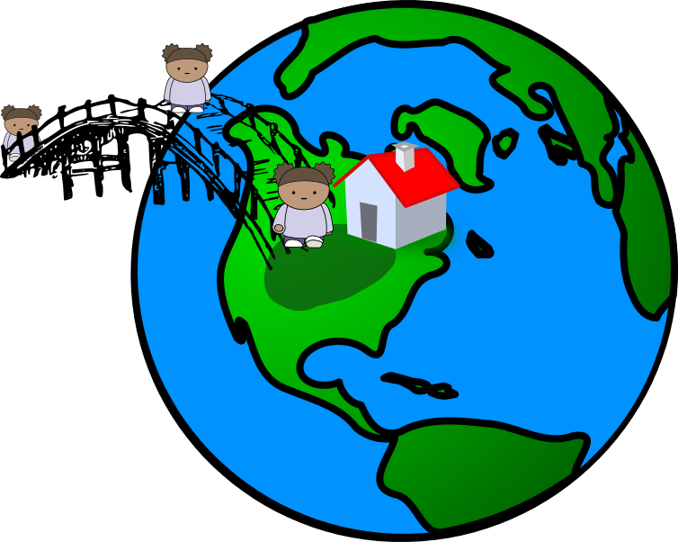
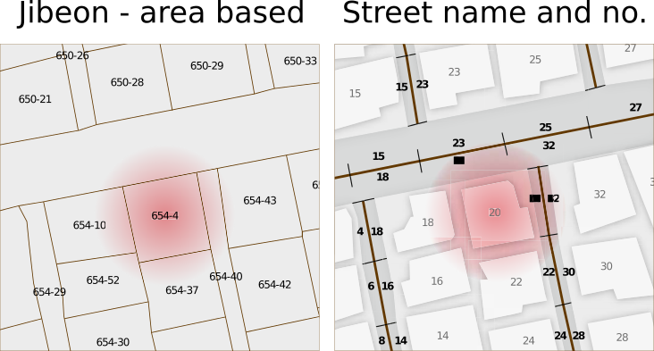
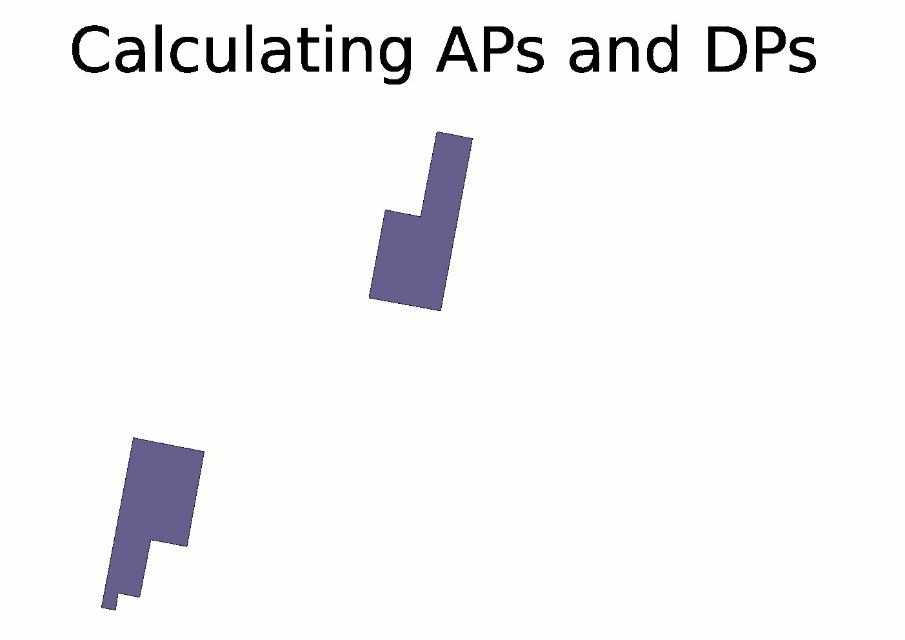
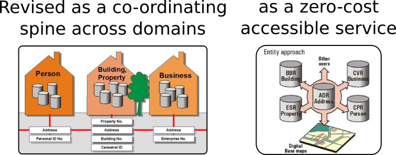
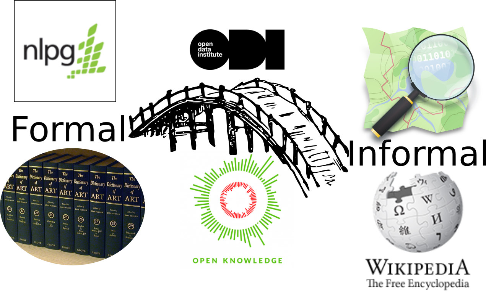
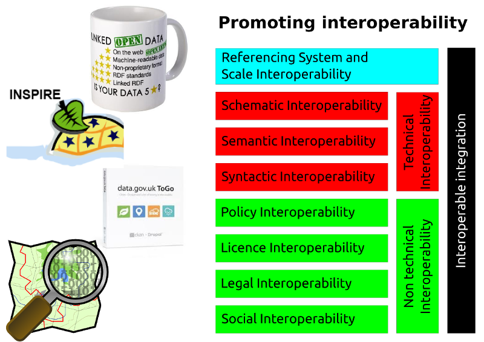
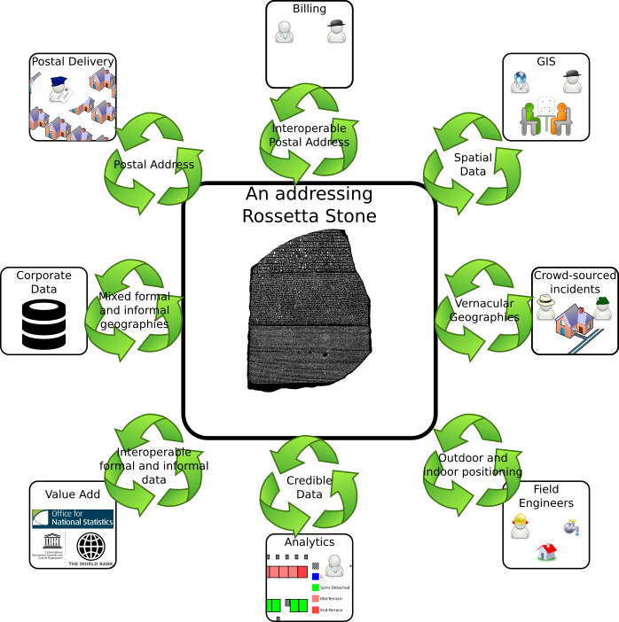
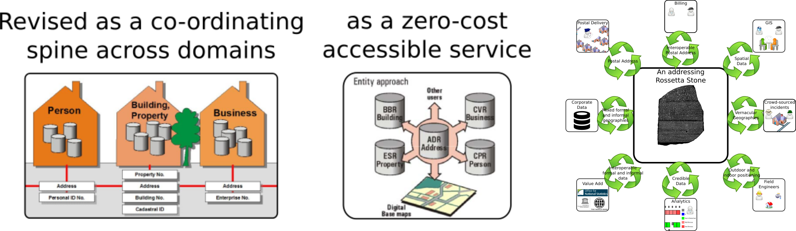

# Going global: the return of the address wars

##   What characteristics are required for Global Address applications in the 21st century?

Anthony Beck (GeoLytics)


Unless states otherwise all content is under a CC-BY licence


\newpage


```python
## PDF output using pandoc

## For a clean export resetart kernel and clear output

import os


### Export this notebook as markdown
commandLineSyntax = 'ipython nbconvert --to markdown 20190306_Global_Address_Wars_Presentation.ipynb'
print (commandLineSyntax)

os.system(commandLineSyntax)

### Export this notebook and the document header as PDF using Pandoc

commandLineSyntax = 'pandoc  -f markdown -t latex -N -V geometry:margin=1in DocumentHeader.md 20190306_Global_Address_Wars_Presentation.md --filter pandoc-citeproc  --latex-engine=xelatex --toc -o 20190306_Global_Address_Wars_Presentation.pdf '

os.system(commandLineSyntax)


```

    ipython nbconvert --to markdown 20190306_Global_Address_Wars_Presentation.ipynb


    0


To convert and run this as a static presentation run the following command:


```python
# Notes don't show in a python3 environment

!jupyter nbconvert 20190306_Global_Address_Wars_Presentation.ipynb --to slides --post serve
```

To close this instances press *control 'c'* in the *ipython notebook* terminal console

Static presentations allow the presenter to see *speakers notes* (use the 's' key)

If running dynamically run the scripts below


```python
#Future proof python 2
from __future__ import print_function #For python3 print syntax
from __future__ import division

# def
import IPython.core.display

# A function to collect user input - ipynb_input(varname='username', prompt='What is your username')

def ipynb_input(varname, prompt=''):
        """Prompt user for input and assign string val to given variable name."""
        js_code = ("""
            var value = prompt("{prompt}","");
            var py_code = "{varname} = '" + value + "'";
            IPython.notebook.kernel.execute(py_code);
        """).format(prompt=prompt, varname=varname)
        return IPython.core.display.Javascript(js_code)
    
# inline

%pylab inline
```

\newpage

## About me

 


* Honorary Research Fellow, University of Nottingham: [orcid](http://orcid.org/0000-0002-2991-811X)
* Director, Geolytics Limited - A spatial data analytics consultancy

## About this presentation

* [Available on GitHub](https://github.com/AntArch/Presentations_Github/tree/master/20190306_BCS_Scotland_Presentation) - https://github.com/AntArch/Presentations_Github/
* [Fully referenced PDF](https://github.com/AntArch/Presentations_Github/blob/master/20190306_BCS_Scotland_Presentation/20190306_Global_Address_Wars.pdf)

\newpage

# Addresses

## are part of the fabric of everyday life


\newpage

## Have economic and commercial impact


\newpage

## Support governance and democracy


* Addresses are a pre-requisite for citizenship in many countries. 
* Without citizenship individuals are excluded from:
	* public services 
	* formal institutions.
* This impacts on democracy. 

\newpage

## Support Legal and Social integration


* Formal versus Informal
* Barring individuals and businesses from systems:
	* financial
	* legal
	* government
	* ....

\newpage

## Provide spatial structure.


* This helps to identify, locate and access marginalized areas.

\newpage

## Bridge gaps



provide the link between ***people*** and ***place***

\newpage

# What is an address?

##  Address abstraction

* Address did not spring fully formed into existance. 
* They are used globally
	* but developed nationally
	* and for different reasons

\newpage

## Address abstraction


\newpage

## In the beginning ...... was the ledger, the register, the record


\newpage

## Then came formalisation

* Local Land and Property Gazetteers and Registers
* Mail
* Address Base
* The World Bank
* Etc.........

Let's look at some

\newpage

###  Korea: The Jibeon system - taxation

* Until recently, the Republic of Korea (Korea) has used land parcel referening (jibeon) 
    * Parcels are assigned chronologically according to date of construction. 
    * **No local predictability**.




* Until recently, the Republic of Korea (Korea) has used land parcel numbers ( jibeon) to identify unique locations. 
    * These parcel numbers were assigned chronologically according to date of construction and without reference to the street where they were located. 
    * This meant that adjacent buildings did not necessarily follow a sequential numbering system.
* This system was initially used to identify land for census purposes and to levy taxes. 
* In addition, until the launch of the new addressing system, the jibeon was also used to identify locations (i.e. a physical address). 

\newpage


### UK Addressing  Geoplace - Formal

](https://www.geoplace.co.uk/documents/10181/67776/NAG+infographic/835d83a5-e2d8-4a26-bc95-c857b315490a?t=1434370410424)


* GeoPlace is a limited liability partnership owned equally by the [Local Government Association](http://www.local.gov.uk/) and [Ordnance Survey](http://www.ordnancesurvey.co.uk/). 
* It has built a synchronised database containing spatial address data from 
    * 348 local authorities in England and Wales (the *Local Land and Property Gazetteers* (LLPG) which cumulatively create the *National Land and Property Gazetteer* (NLPG)), 
    * Royal Mail, 
    * Valuation Office Agency and 
    * Ordnance Survey datasets. 
* The NAG Hub database is owned by GeoPlace and is the authoritative single source of government-owned national spatial address information, containing over 225 million data records relating to about 34 million address features. GeoPlace is a production organisation with no product sales or supply operations. 
* The NAG is made available to public and private sector customers through Ordnance Survey’s [AddressBase](http://www.ordnancesurvey.co.uk/business-and-government/products/addressbase.html) products.

\newpage

###  The AddressBase Family

](http://demos.ordnancesurvey.co.uk/public/demos/products/AddressBase/images/database_3_0.jpg)


* The National Address Gazetteer Hub database is owned by GeoPlace and is claimed to be *the authoritative single source of government-owned national spatial address information*, containing over 225 million data records relating to about 34 million address features. 
* Each address has its own *Unique Property Reference Number* (UPRN). The AddressBase suite have been designed to integrate into the [Ordnance Survey MasterMap suite of products](http://www.ordnancesurvey.co.uk/business-and-government/products/mastermap-products.html). 

AddressBase is available at three levels of granularity (lite, plus and premium). 

* AB+ merges two address datasets together (PAF and Local Authority) to provide the best available view of addresses currently defined by Local Authorities, giving many advantages over AddressBase.
* AB+ lets you link additional information to a single address, place it on a map, and carry out spatial analysis that enables improved business practices.
* Geoplace argue that further value comes from additional information in the product which includes:
	* A more detailed classification – allowing a better understanding of the type (e.g. Domestic, Commercial or Mixed) and function of a property (e.g.  Bank or Restaurant)
	* Local Authority addresses not contained within PAF – giving a more complete picture of the current addresses and properties (assuming they are in scope (see below))
	* Cross reference to OS MasterMap TOIDs – allowing simple matching to OS MasterMap Address Layer 2, Integrated Transport Network or Topography Layer
	* Spatial coordinates
	* Unique Property Reference Number (UPRN) – which provides the ability to cross reference data with other organisations, and maintain data integrity.
* Premium includes the address lifecycle


AddressBase supports the UK Location Strategy concept of a 'core reference geography', including the key principles of the European Union INSPIRE directive, that data should only be collected once and kept where it can be maintained most effectively (see [AddressBase products user guide](http://www.ordnancesurvey.co.uk/docs/user-guides/addressbase-products-user-guide.pdf)). *It's probably worthwhile mentioning that this is not an open address layer - however, a [2104 feasibility study sponsored by the department of Business, Innovation and Skills](https://www.gov.uk/government/publications/an-open-national-address-gazetteer) included a recommendation that AddressBase lite is made openly available*.

\newpage

### Royal Mail - Access and Delivery points



\newpage

###  Denmark: An addressing commons

* Geocoded address infrastructure
* Defined the semantics of purpose
	* what is an address
* Open data
	* an address commons with full stakeholder engagement and participation
    * **There is no such thing as an unmatched address**




* Geocoded address infrastructure
* Defined the semantics of purpose
	* what is an address
* Open data
	* an address commons
* The re-use statistics are staggering:
	* 70% of deliveries are to the private sector, 
	* 20% are to central government
	* 10% are to municipalities.
* Benefits:
	* Efficiencies
	* No duplication
	* Improved confidence
	* Known quality
    * **There is no such thing as an unmatched address**

A credible service providing a mutlitude of efficiencies (@_addressing_2012, pp.50 - 54)

\newpage

### The World Bank


* Urban bias
* Cost of infrastucture development
* Lack of community involvement

The World Bank has taken a *street addressing* view-point (@_addressing_2012, p.57). This requires up-to-date mapping and bureacracy (to deliver a street gazetteer and to provide the street infrastructure (furniture)). However, (@_addressing_2012, p.44) demonstrates that this is a cumbersome process with a number of issues, not the least:

* Urban bias
* Cost of infrastucture development
* Lack of community involvement

\newpage

# Addressing issues


* Addresses are increasingly over-loaded
	* Assets as addresses
	* Services as addresses
	* People as/at addresses
* Addresses as things

](https://upload.wikimedia.org/wikipedia/commons/0/0d/Mono_pensador.jpg)

\newpage

## Issues: addresses = postal address.

* Is *Postal* a constraining legacy?
* Is *address* a useful term? 

](https://upload.wikimedia.org/wikipedia/commons/0/0d/Mono_pensador.jpg)

\newpage

# Taking stock

##  Addresses are heterogeneous

In terms of:

* What they mean
* What they are used for
* Who uses them
* How they are accessed


\newpage

##  Assets can have addresses

So - anything can have an address (the *Internet of Things*)

](http://joncruddas.org.uk/sites/joncruddas.org.uk/files/styles/large/public/field/image/post-box.jpg?itok=ECnzLyhZ)

\newpage

##  National data silos

* They have been created to solve national issues.
    * Applying different paradigms
    * Are *relative referencing system* that do not implicitly provide an accurate spatial location.
* No unifying semantics.


\newpage

##  Licence silos


\newpage

##  Addresses are bureaucratic and costly


Severely protracted when formal/informal issues are encountered.

\newpage

##  Addresses can be opaque


**transparent reproducibility critical for those at the beginning and end of the addressing lifecycle**

\newpage

##  Addresses are of global significance


\newpage

##  Addresses are ripe for disruption


\newpage

# What about the address disenfranchised?


> It is almost impossible for individuals to be part of society without a legal identity. 

> 4 billion people are excluded from the rule of law because they do not have a legal identity, and that **establishing such an identity often depends on having an official address**.

> Addresses appear to be a key element in aiding the delivery of policies at national and international levels ....

@_addressing_2012 p. 6

... particularly with regard to:

* governance
* rule of law
* poverty reduction
* disease prevention
* the provision of basic services such as:
	* electricity
	* sanitation
	* water.

@_addressing_2012 p. 6

> This century is witnessing a fundamental change in our way of life; for the first time in history, half of the world’s population lives in towns and cities. 

> Urban areas are growing faster in developing countries, mostly **through informal settlements.**

> The lack of an address, particularly in informal settlements, can also mean the lack of legal identity, equal opportunities for employment and social integration.

@_addressing_2012 p. 6

Addresses are becoming a ***basic human right***.

\newpage

## The World Bank have a plan


\newpage

## But in Africa:


It's difficult to do street based addressing when there are no streets!

The mapping of informal settlements in urban area implies legitamacy - hence it's not done!

And this does exacerbate the urban rural divide.

\newpage

## Legitimacy


Formal and informal barriers are profound


\newpage

# What are the aspirations for a global addressing framework?

Or an addressing commons?


\newpage

##  It will need to harmonise the formal and informal



\newpage

## It should meet the needs of the rural and urban communities equally


\newpage

## It should be lightweight and cheap to implement


\newpage

## It should be transparent, reproducible and predictable


\newpage

## It should be born spatial and global

An address system should not require specific geocoding services to make it spatial.

Streets are so last century.....


* Ubiquitous GPS/GNSS
* Structured crowdsourced geo-enabled content (wikipedia, OSM)


\newpage

## It should be an openly licenced Core Reference data set

The situation is best summarised by the open access Danish addressing commons [@_addressing_2012 p. 54]:


The re-use statistics are staggering:
* 70% of deliveries are to the private sector, 
* 20% are to central government
* 10% are to municipalities.

**There is no such thing as an unmatched address**.

\newpage

## It should be accessible (on and off-line)


\newpage

## It should support and enhance business services


\newpage

## It should support many ways of engagement

](https://upload.wikimedia.org/wikipedia/commons/thumb/2/22/Love_talk_-_The_Noun_Project.svg/480px-Love_talk_-_The_Noun_Project.svg.png)

[What3Words completely get this!](https://player.fm/series/local-to-global-with-nick-hewer/reinventing-the-postcode-with-what3words)

\newpage

# A new global address paradigm?  

* [Amazon drone delivery in the UK requires](https://www.theguardian.com/technology/2016/jul/25/amazon-to-test-drone-delivery-uk-government)
	* A new view over addressing complements streets and buildings but is geo-coded at source
	* and supports accurate delivery throughout the delivery chain using a global referencing system.

Is there a universal approach which allows all avenues to be satisfied?

](figures/Guardian_Amazon_drone.png)


\newpage

#  How might this look? CORE

.
.

**MUST HAVE** Core requirements for a Global Address Framework

.
.

\newpage

##  WGS84 algorithmic address minting

* **Born spatial**
* **Accessible**
* **Lightweight and cheap to implement**
* **Transparent, reproduceable and predicatable**


\newpage

##  Small footprint

* **Accessible**
* **Lightweight and cheap to implement**


\newpage

##  Short/memorable

**Support and enhance business services**


\newpage

##  Self checking 

* **Support and enhance business services**


\newpage

## Unlimited spatial recording

* **Support and enhance business services**
* **Formal and informal, Rural and Urban**
    * What are the spatial requirements for the range of addressing options?
        * [Manila has a population density of 42,857 people per square km](http://en.wikipedia.org/wiki/List_of_cities_proper_by_population_density). 
        * [Map Kibera](http://mapkibera.org/) and OSM has revolutionised service delivery in Kibera (Kenya). 
            * Address Kibera could do the same thing for citizenship.


\newpage

## Open and interoperable

* **Transparent, reproduceable and predicatable**
* **Openly Licensed**




\newpage

> the lack of a consistent and transparent legal and policy framework for sharing spatial data continues to be an additional roadblock.

@pomfret_spatial_2010

\newpage

#  How might this look? Nice to haves

.
.

**Would be nice to have** extended requirements for a Global Address Framework

.
.

\newpage

##  Indoor use and 3D

* **Support and enhance business services**
* Incorporating wifi-triangulation - *individual room* addressing and navigation.
* Seamless integration with BIM and CityGML.
* *Addressing isn't only about buildings and 2D - think 3D and the Internet of Things*


\newpage

##  Inherent geo-statistical aggregation (spatially scalable)

* **Support and enhance business services**
* GIS free multi-scale analysis and reporting during disaster scenarios.


\newpage

## Area representation based on a regular tessellation

* **Support and enhance business services**
    * It is still useable within traditional GIS.

](https://upload.wikimedia.org/wikipedia/commons/thumb/1/11/Tesselation_pipeline.svg/800px-Tesselation_pipeline.svg.png)


\newpage

## Spatial adjacency relations within the encoding

* **Support and enhance business services**
    * Understanding localised connectivity relations.


\newpage

# What do you want your technology candidates to do?

BCS examples (in alphabetical order):

* [GeoHash](http://en.wikipedia.org/wiki/Geohash)
	* [gcpvj1r2vnbp](http://geohash.org/gcvwr2mkkhe1)
* [Maidenhead Locator System](http://en.wikipedia.org/wiki/Maidenhead_Locator_System)
	* IO85jw (it has a very large footprint)
* [MapCode](http://www.mapcode.com/)
	* GBR 8PJ.TJ	
* [Natural Area Code](http://nactag.info/map.asp)
	* GQ0X1 S9PNR
* [What3Words](http://what3words.com/)
	* [assume.calms.union](https://map.what3words.com/assume.calms.union)


\newpage

## Combining frameworks

* One size doesn't have to fit all.
* Build bridges between Global and National frameworks
* Understand fitness for purpose for each application

](https://upload.wikimedia.org/wikipedia/commons/thumb/7/74/Duimstok_50cm.jpg/640px-Duimstok_50cm.jpg)


\newpage




\newpage

## Q. How do we encourage such infrastructure development?


\newpage

## A. Support [core reference geographies](http://www.slideshare.net/geocommunitylive/bob-barr-what-are-core-reference-geographies)

Bob Barr has described [core reference geographies](http://www.slideshare.net/geocommunitylive/bob-barr-what-are-core-reference-geographies) as geographic data which:

* Are definitive
* Should be collected and maintained once and used many times
* Are Natural monopolies (which addresses are)
* Have variable value in different applications
* Have highly elastic demand

**Global addresses are a core reference geography.**


\newpage

## Wrap up.... A GeoCommons core supporting formal and informal services

What if global addressing, as a core reference geography, was an inclusive loosely coupled GeoCommons......... 




\newpage

## Questions

 


```python

```
